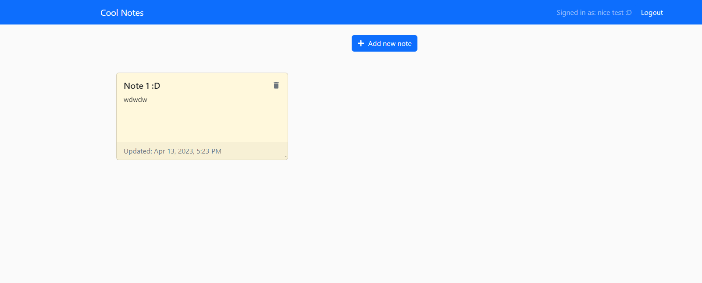
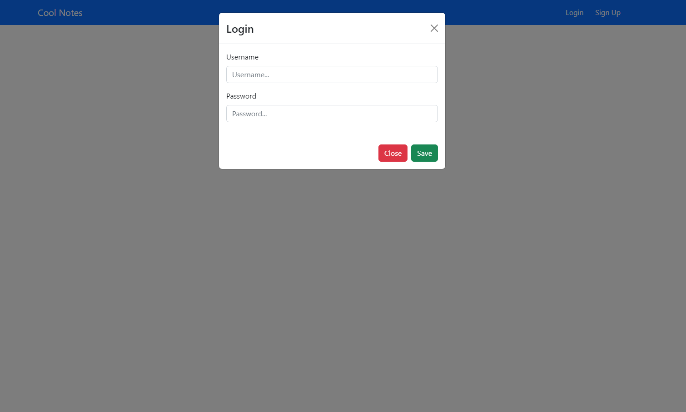

# Cool-Notes MERN Project

This is a full-stack web application built with MERN (MongoDB, Express.js, React, and Node.js) stack using Typescript. The application has authentication feature using Express-session, which allows users to sign up, log in, and log out.

The front-end of the application was built using React and React-Bootstrap, and the back-end was built using Express.js and MongoDB.

## Features

* User authentication using Express-session
* Create, edit, and delete notes

## Technologies used

* MongoDB
* Express.js
* React
* Node.js
* Typescript
* React-Bootstrap

## Installation and Setup

To run the application locally, follow these steps:

1. Clone the repository

git clone <https://github.com/Kurler3/cool-notes.git>

2. cd cool-notes

3. Open 2 terminals

4. First terminal => cd backend => npm i

5. Second terminal => cd client => npm i

6. In terminal 1 => npm run start

7. In terminal 2 => npm run dev

## Screenshots

* Home page

* Login

